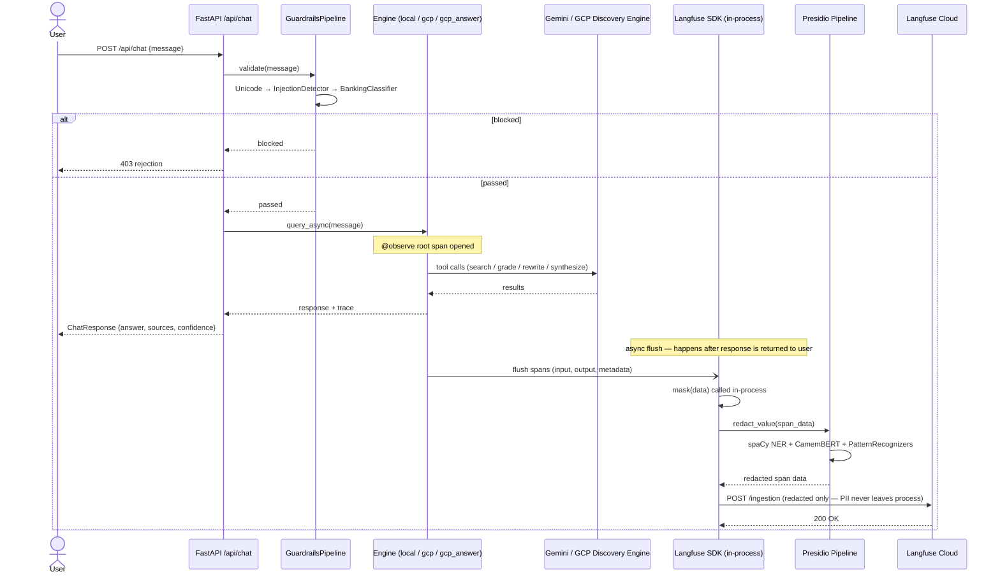

# PII Redaction in Langfuse Traces — Decision Document

**Project:** Shine Agentic Banking · Banking AI Foundation & Ops Efficiency  
**Status:** Draft for team review  
**Timebox:** Complete by Monday EOD  
**Author:** Abhimanyu Aryan  

---

## 1. Final Entity List with Placeholder Mapping

The entity list below is grounded in GDPR Article 4 definitions and the Shine neobank customer support context (account problems, payment disputes, onboarding blockers). Entities are grouped by category and ordered by detection priority.

### 1.1 Personal Identifiers

| Entity | Placeholder | Detection Method | Notes |
|--------|------------|-----------------|-------|
| Full name | `[NAME]` | NER (PERSON) | Highest-frequency entity in support transcripts |
| Date of birth | `[DOB]` | Regex + NER (DATE) | Pattern: DD/MM/YYYY, DD-MM-YYYY, "né le…" |

### 1.2 Contact Information

| Entity | Placeholder | Detection Method | Notes |
|--------|------------|-----------------|-------|
| Email address | `[EMAIL]` | Regex (RFC 5321 subset) | Language-agnostic; high precision |
| Phone number (FR) | `[PHONE]` | Regex | Patterns: `0[6-9]\d{8}`, `+33[67]\d{8}`, local variants |
| Postal address | `[ADDRESS]` | NER (LOC) + regex | Combine NER with French postal code regex `\d{5}` |

### 1.3 Financial Identifiers

| Entity | Placeholder | Detection Method | Notes |
|--------|------------|-----------------|-------|
| IBAN | `[IBAN]` | Regex + Luhn/modulo97 checksum | FR IBAN: `FR\d{2}[A-Z0-9]{23}` |
| BIC/SWIFT | `[BIC]` | Regex | 8 or 11 chars: `[A-Z]{4}[A-Z]{2}[A-Z0-9]{2}([A-Z0-9]{3})?`; almost always co-occurs with IBAN |
| RIB components | `[RIB]` | Regex | Bank code (5d) + branch code (5d) + account (11c) + key (2d) |
| Card number | `[CARD]` | Regex + Luhn checksum | PAN formats: 16d with optional separators |
| Transaction reference | `[TXREF]` | Regex / context | Shine-specific format — define internal pattern |
| Crypto wallet — Bitcoin | `[CRYPTO_WALLET]` | Regex | Legacy: `[13][a-km-zA-HJ-NP-Z1-9]{25,34}`; bech32: `bc1[a-z0-9]{39,59}` |
| Crypto wallet — Ethereum | `[CRYPTO_WALLET]` | Regex | `0x[a-fA-F0-9]{40}` |

### 1.4 Business Identifiers

| Entity | Placeholder | Detection Method | Notes |
|--------|------------|-----------------|-------|
| SIRET | `[SIRET]` | Regex + Luhn-mod97 | 14 digits; validate checksum; always redact before SIREN check |
| SIREN | `[SIREN]` | Regex + Luhn | 9 digits; root of SIRET — freelancers often share SIREN alone; run after SIRET to avoid double-redacting |
| TVA intracommunautaire | `[VAT]` | Regex | `FR[A-Z0-9]{2}\d{9}`; structurally embeds SIREN; high frequency in invoicing conversations |
| RCS number | `[RCS]` | Regex + context | Format varies by greffe (`\d{3}\s?\d{3}\s?\d{3}`); context words: "RCS", "registre du commerce" |

### 1.5 Government-Issued Identifiers

| Entity | Placeholder | Detection Method | Notes |
|--------|------------|-----------------|-------|
| NIR (numéro sécu) | `[NIR]` | Regex + checksum | `[12]\d{2}(0[1-9]\|1[0-2]\|[2-9]\d)\d{5,6}\d{2}` then 97-mod |
| French national ID (CNI) | `[NATIONAL_ID]` | Regex | 12 digits; CNI format varies — add deny-list for format strings |
| French passport number | `[PASSPORT]` | Regex + context | New format: 2 alphanum + 7 digits (`[A-Z0-9]{2}\d{7}`); context words: "passeport", "numéro de passeport" |
| Driver's license (permis) | `[DRIVERS_LICENSE]` | Regex + context | 12 alphanumeric chars (post-2013 harmonised EU format); context: "permis de conduire", "permis B" |
| Titre de séjour | `[RESIDENCE_PERMIT]` | NER + context | Format varies; rely on context words: "titre de séjour", "carte de résident", "récépissé" |

### 1.6 Digital Identifiers

| Entity | Placeholder | Detection Method | Notes |
|--------|------------|-----------------|-------|
| IPv4 address | `[IP]` | Regex | `\b(?:\d{1,3}\.){3}\d{1,3}\b` |
| IPv6 address | `[IP]` | Regex | Colon-hex notation |
| MAC address | `[MAC]` | Regex | `([0-9A-Fa-f]{2}[:\-]){5}[0-9A-Fa-f]{2}` |

### 1.7 GDPR Article 4 Alignment

All entities above satisfy Article 4(1) definition: *"any information relating to an identified or identifiable natural person."* The NIR, card number, and IBAN are also **sensitive** under Article 9 context in a financial setting. SIRET/SIREN are legal entity identifiers but frequently co-appear with personal directors' names — redacting them prevents re-identification. SIREN must be checked after SIRET to avoid double-redacting the first 9 digits. VAT numbers structurally embed the SIREN, so the same re-identification risk applies. Transaction references are pseudonyms but are linkable to individuals — treated as PII under Article 4(5). Crypto wallet addresses are pseudonymous but linkable on-chain — treated as PII under Article 4(5). Titre de séjour and passport/driver's license numbers are special-category adjacent given their link to immigration status.

---

## 2. Tooling Recommendation

### 2.1 Evaluation Matrix

| Criterion | Microsoft Presidio + spaCy fr_core_news_lg | CamemBERT-based HuggingFace NER | Regex-only fallback |
|-----------|-------------------------------------------|--------------------------------|---------------------|
| French NER quality | ★★★☆ — `fr_core_news_lg` is CNN-based; known false positives on common French words | ★★★★★ — SOTA for French; CamemBERT fine-tuned on French corpora outperforms spaCy significantly | ✗ — No NER; misses unstructured names/addresses |
| Custom entity support | ★★★★★ — First-class `PatternRecognizer` and `EntityRecognizer` APIs; easy regex + context words | ★★★☆ — Custom entities require fine-tuning or wrapping as Presidio remote recognizer | ★★★★★ — Trivially extensible |
| Integration effort | ★★★★☆ — Well-documented; `mask` callback fits directly into Langfuse SDK | ★★★☆ — Requires wrapping as Presidio recognizer or standalone scanner | ★★★★★ — Pure Python; minimal deps |
| Maintenance burden | ★★★★☆ — Active Microsoft-backed OSS; 3.5k+ stars; regular releases | ★★★★☆ — HuggingFace ecosystem; model must be pinned | ★★★★★ — Zero external dependencies |
| Runs locally | ✅ | ✅ | ✅ |

### 2.2 Recommended Stack: Presidio + fr_core_news_lg + CamemBERT NER wrapper + Custom regex recognizers

**Decision: Presidio as orchestration layer with a dual NER backend.**

Architecture:

```
presidio-analyzer
  ├── NlpEngine: spaCy fr_core_news_lg (fast; handles tokenization + basic NER)
  ├── Remote/Custom Recognizer: CamemBERT NER (wraps camembert-ner or dslim/bert-base-NER)
  └── PatternRecognizers (regex):
        IBAN, RIB, CARD (+ Luhn), NIR (+ modulo-97), SIRET, PHONE_FR, EMAIL, IP, DOB, TXREF
```

**Why Presidio:**
- Acts as an **orchestration layer**: composing NER models, regex recognizers, and context-boosting in a single pipeline call. This avoids writing our own fan-out logic.
- The `mask` function hook in Langfuse SDK (`Langfuse(mask=redact_fn)`) accepts any callable — Presidio slots in directly.
- Multi-language configuration is well-supported: Presidio's NLP engine can be adapted to support multiple languages including French, and context words for confidence-boosting can be provided per language.
- Supports predefined or custom PII recognizers leveraging Named Entity Recognition, regular expressions, rule-based logic, and checksum validation in multiple languages.

**Why add CamemBERT on top:**
- Research comparing spaCy `fr_core_news_lg` with CamemBERT on French NER adaptation tasks shows a clear performance gap; the CNN-based spaCy model has the most difficult adaptation while CamemBERT demonstrates superior results. For person names in support chat language (informal, abbreviated), this gap matters.
- The CamemBERT recognizer can be wrapped as a Presidio `EntityRecognizer` so it plugs into the same pipeline.

**Why regex for financial entities:**
- IBAN, NIR, SIRET, card numbers are structurally deterministic. A correct regex + checksum is **more reliable** than any NER model for these. NER adds nothing here.
- Presidio's `PatternRecognizer` supports context words (e.g., "mon IBAN est", "numéro de sécurité sociale") to boost confidence scores on ambiguous matches.

**Alternative considered: LLM Guard (reject)**
- LLM Guard includes a PII scanner backed by a transformer model but does not support checksum validation for French financial entities and adds a heavier dependency footprint. Rejected as primary tool; could be layered later for toxicity/prompt-injection scanning alongside Presidio PII detection.

**Alternative considered: Stanza + Presidio (defer)**
- Stanford's Stanza has a French model (`fr`) with NER, but it is slower than spaCy and the French NER quality at the PER/LOC level is comparable. Not worth the additional dependency given we already pin spaCy. Revisit if CamemBERT latency proves problematic.

---

## 3. Proposed Redaction Architecture

### 3.1 Single Interception Point: Langfuse `mask` Callback

The Langfuse Python SDK supports a `mask` function provided at client initialization time; this function is applied to all relevant trace data before it is sent to Langfuse, and the returned data must be JSON-serializable.

This is the **only interception point needed**. It covers:
- User inputs (chat messages, form fields)
- Model outputs (LLM completions)
- Tool call arguments and results (MCP tool I/O, RAG retrieval payloads)
- Metadata attached to spans

**Fail-open guarantee:** The mask function must be wrapped in a try/except that returns the original data on any exception. Redaction failures are logged but never block trace publication.

### 3.2 Implementation Sketch

```python
# redaction/engine.py
from presidio_analyzer import AnalyzerEngine, RecognizerRegistry
from presidio_analyzer.nlp_engine import NlpEngineProvider
from presidio_anonymizer import AnonymizerEngine
from presidio_anonymizer.entities import OperatorConfig
import logging

logger = logging.getLogger(__name__)

# --- Build once at module load ---
def _build_analyzer() -> AnalyzerEngine:
    nlp_config = {
        "nlp_engine_name": "spacy",
        "models": [{"lang_code": "fr", "model_name": "fr_core_news_lg"}],
    }
    provider = NlpEngineProvider(nlp_configuration=nlp_config)
    nlp_engine = provider.create_engine()
    registry = RecognizerRegistry()
    registry.load_predefined_recognizers(languages=["fr"])
    # Register custom recognizers (IBAN, NIR, SIRET, FR_PHONE, TXREF)
    from redaction.recognizers import (
        IBANRecognizer, BICRecognizer, NIRRecognizer,
        SIRETRecognizer, SIRENRecognizer, VATRecognizer, RCSRecognizer,
        FrenchPhoneRecognizer, PassportRecognizer, DriversLicenseRecognizer,
        CryptoWalletRecognizer, MACAddressRecognizer, TransactionRefRecognizer,
    )
    for rec in [
        IBANRecognizer(), BICRecognizer(), NIRRecognizer(),
        SIRETRecognizer(), SIRENRecognizer(), VATRecognizer(), RCSRecognizer(),
        FrenchPhoneRecognizer(), PassportRecognizer(), DriversLicenseRecognizer(),
        CryptoWalletRecognizer(), MACAddressRecognizer(), TransactionRefRecognizer(),
    ]:
        registry.add_recognizer(rec)
    return AnalyzerEngine(
        nlp_engine=nlp_engine,
        registry=registry,
        supported_languages=["fr"],
    )

_analyzer = _build_analyzer()
_anonymizer = AnonymizerEngine()

OPERATORS = {
    # Personal
    "PERSON":             OperatorConfig("replace", {"new_value": "[NAME]"}),
    "EMAIL_ADDRESS":      OperatorConfig("replace", {"new_value": "[EMAIL]"}),
    "PHONE_NUMBER":       OperatorConfig("replace", {"new_value": "[PHONE]"}),
    "LOCATION":           OperatorConfig("replace", {"new_value": "[ADDRESS]"}),
    "DATE_TIME":          OperatorConfig("replace", {"new_value": "[DOB]"}),
    # Financial
    "IBAN":               OperatorConfig("replace", {"new_value": "[IBAN]"}),
    "BIC":                OperatorConfig("replace", {"new_value": "[BIC]"}),
    "RIB":                OperatorConfig("replace", {"new_value": "[RIB]"}),
    "CREDIT_CARD":        OperatorConfig("replace", {"new_value": "[CARD]"}),
    "TXREF":              OperatorConfig("replace", {"new_value": "[TXREF]"}),
    "CRYPTO_WALLET":      OperatorConfig("replace", {"new_value": "[CRYPTO_WALLET]"}),
    # Business — SIRET before SIREN to avoid double-redacting the 9-digit prefix
    "SIRET":              OperatorConfig("replace", {"new_value": "[SIRET]"}),
    "SIREN":              OperatorConfig("replace", {"new_value": "[SIREN]"}),
    "VAT":                OperatorConfig("replace", {"new_value": "[VAT]"}),
    "RCS":                OperatorConfig("replace", {"new_value": "[RCS]"}),
    # Government IDs
    "NIR":                OperatorConfig("replace", {"new_value": "[NIR]"}),
    "NATIONAL_ID":        OperatorConfig("replace", {"new_value": "[NATIONAL_ID]"}),
    "PASSPORT":           OperatorConfig("replace", {"new_value": "[PASSPORT]"}),
    "DRIVERS_LICENSE":    OperatorConfig("replace", {"new_value": "[DRIVERS_LICENSE]"}),
    "RESIDENCE_PERMIT":   OperatorConfig("replace", {"new_value": "[RESIDENCE_PERMIT]"}),
    # Digital
    "IP_ADDRESS":         OperatorConfig("replace", {"new_value": "[IP]"}),
    "MAC_ADDRESS":        OperatorConfig("replace", {"new_value": "[MAC]"}),
}

def redact_text(text: str) -> str:
    results = _analyzer.analyze(text=text, language="fr")
    return _anonymizer.anonymize(
        text=text,
        analyzer_results=results,
        operators=OPERATORS,
    ).text

def redact_value(value) -> object:
    """Recursively redact strings within any JSON-serializable structure."""
    if isinstance(value, str):
        return redact_text(value)
    elif isinstance(value, dict):
        return {k: redact_value(v) for k, v in value.items()}
    elif isinstance(value, list):
        return [redact_value(item) for item in value]
    return value

# Fail-open mask function for Langfuse SDK
def langfuse_mask(*, data) -> object:
    try:
        return redact_value(data)
    except Exception as exc:
        logger.warning("PII redaction failed, publishing unredacted: %s", exc)
        return data
```

```python
# src/agentic_rag/rag_pipeline/agent.py  (and gcp_agent.py / chat.py)
# Replace get_client() with a client initialised with the mask hook.
# Langfuse uses a module-level singleton; mask must be set on first construction.
from langfuse import Langfuse
from redaction.engine import langfuse_mask

langfuse = Langfuse(mask=langfuse_mask)
# All subsequent get_client() calls return this singleton — no further changes needed.
```

### 3.3 Data Flow Coverage

The sequence diagram below reflects the actual application stack (Google ADK + GCP Discovery Engine, no LangChain). The key insight is that `mask()` is called **in-process, before any network call** — raw PII is never transmitted to Langfuse.



**Spans captured by the mask hook across all three engines:**

| Span name | Engine | Data redacted |
|---|---|---|
| `guardrails-validate` | all | user message, guardrail verdict |
| `classify_and_search` | local | user query, classification output, retrieved chunks |
| `vector_search` | local | query, chunk text + metadata |
| `grade_relevance` | local | query, chunk text, grade output |
| `rewrite_query` | local | original + rewritten query |
| `multi_search` | local | sub-queries, chunk text |
| `synthesis` | local + gcp | full context window, final response |
| `gcp-agentic-rag-query` | gcp | query, GCP search results, response |
| `gcp-agent-search` | gcp_answer | query, GCP answer payload |

### 3.4 What is NOT covered (accepted risks)

- **Images / screenshots** embedded in traces: Presidio has an image redaction module (`presidio-image-redactor`) but it requires OCR. Excluded from v1 scope; flag to team.
- **Langfuse self-hosted server-side masking**: For self-hosted deployments, Langfuse provides a masking callback service that can be implemented server-side; events ingested via third-party OpenTelemetry instrumentation libraries may bypass this hook. We rely on client-side masking (the SDK `mask` param) as the primary control, server-side as defense-in-depth.
- **Structured data exports** (CSV/JSON from Langfuse): Out of scope for this sprint; require a separate data egress control.
- **Undetected PII** in domain-specific tokens (e.g., an account nickname that is actually a person's name): accepted residual risk per brief.

---

## 4. Open Questions and Risks

### 4.1 Latency Impact
Presidio + spaCy adds ~20–80ms per call on CPU for short support messages. CamemBERT adds ~150–300ms per call. For agentic pipelines where traces are published asynchronously (Langfuse SDK batches spans), this is acceptable. Validate against the p99 trace flush latency in staging before production rollout.

**Mitigation:** Run CamemBERT recognizer only for spans where text length > 50 chars and entity probability from spaCy is below a threshold. Use `spaCy` as the fast first pass.

### 4.2 French vs. Mixed-Language Input
Support agents and users sometimes mix French and English in the same message. Presidio's `language` parameter is set per-request. We need either auto-detection (e.g., `langdetect`) or always-run-fr mode (which may under-detect English names). Recommend: default to `fr`, fall back to `en` if `langdetect` confidence < 0.8.

### 4.3 NIR False Positives
The NIR regex matches any 15-digit sequence satisfying the mod-97 checksum. Long transaction amounts or account numbers could theoretically match. Mitigate with **context words**: add `["sécu", "sécurité sociale", "numéro de sécurité", "nir", "cmu"]` as context boosts in the `PatternRecognizer`.

### 4.4 Transaction Reference Format
Shine's internal `TXREF` format is not documented publicly. The `TransactionRefRecognizer` must be initialized with the actual internal regex before going live. **Risk: if the format changes, the recognizer silently stops matching.** Recommend: unit tests seeded with synthetic transaction references.

### 4.5 GDPR Right to Erasure vs. Trace Immutability
Redaction at write time (before the trace lands in Langfuse) is the preferred approach — no PII ever enters the store. If we later need retroactive redaction of existing traces (right to erasure requests), a separate batch job using the Langfuse API + the same redaction engine will be required. Flag to DPO.

### 4.6 Tokenization of Names Across Turns
In multi-turn agentic traces, a person's name might appear in turn 1 and be referenced by pronoun in turn 5. NER will not catch the pronoun. This is an accepted limitation of entity-level redaction; coreference resolution is out of scope.

### 4.7 Model Version Pinning
Both `fr_core_news_lg` and the CamemBERT model must be pinned in `requirements.txt` / Docker image. A model update could silently change recall/precision. Treat NLP models as code artifacts with versioned releases.

---

## Appendix: Key Regex Patterns (French context)

```python
# IBAN (France)
r"\bFR\d{2}[A-Z0-9]{23}\b"

# BIC/SWIFT (8 or 11 chars)
r"\b[A-Z]{4}[A-Z]{2}[A-Z0-9]{2}(?:[A-Z0-9]{3})?\b"

# NIR (numéro de sécurité sociale) — followed by checksum validation
r"\b[12]\d{2}(?:0[1-9]|1[0-2]|[2-9]\d)\d{5,6}\d{2}\b"

# SIRET (14 digits) — check before SIREN to avoid double-redact
r"\b\d{14}\b"  # + Luhn-style mod-97 validation

# SIREN (9 digits) — only match if not already part of a SIRET match
r"\b\d{9}\b"  # + Luhn validation; use context words to reduce false positives

# TVA intracommunautaire (FR VAT)
r"\bFR[A-Z0-9]{2}\d{9}\b"

# RCS number (Registre du Commerce)
r"\b\d{3}\s?\d{3}\s?\d{3}\b"  # + context words: "RCS", "registre du commerce"

# French mobile phone
r"\b(?:\+33|0033|0)[67]\d{8}\b"

# French landline (broad)
r"\b0[1-9]\d{8}\b"

# Card number (PAN, with optional separators)
r"\b(?:\d{4}[\s\-]?){3}\d{4}\b"  # + Luhn validation

# Date of birth (common FR formats)
r"\b(?:0[1-9]|[12]\d|3[01])[\/\-\.](0[1-9]|1[0-2])[\/\-\.]\d{2,4}\b"

# French passport number (new harmonised format)
r"\b[A-Z0-9]{2}\d{7}\b"  # + context words: "passeport", "numéro de passeport"

# Driver's license (EU harmonised, post-2013)
r"\b[A-Z0-9]{12}\b"  # + context words: "permis de conduire"

# Crypto wallet — Bitcoin (legacy + bech32)
r"\b[13][a-km-zA-HJ-NP-Z1-9]{25,34}\b"
r"\bbc1[a-z0-9]{39,59}\b"

# Crypto wallet — Ethereum
r"\b0x[a-fA-F0-9]{40}\b"

# MAC address
r"\b(?:[0-9A-Fa-f]{2}[:\-]){5}[0-9A-Fa-f]{2}\b"
```

> **Note on SIREN false positives:** The 9-digit pattern is broad and will match any 9-digit number (phone extensions, amounts, dates in YYYYMMDD format). Always pair with context words (`["siren", "n° siren", "numéro siren"]`) and a confidence threshold; only promote to redaction above that threshold. Run SIRET detection first and mask matched spans before the SIREN pass.
